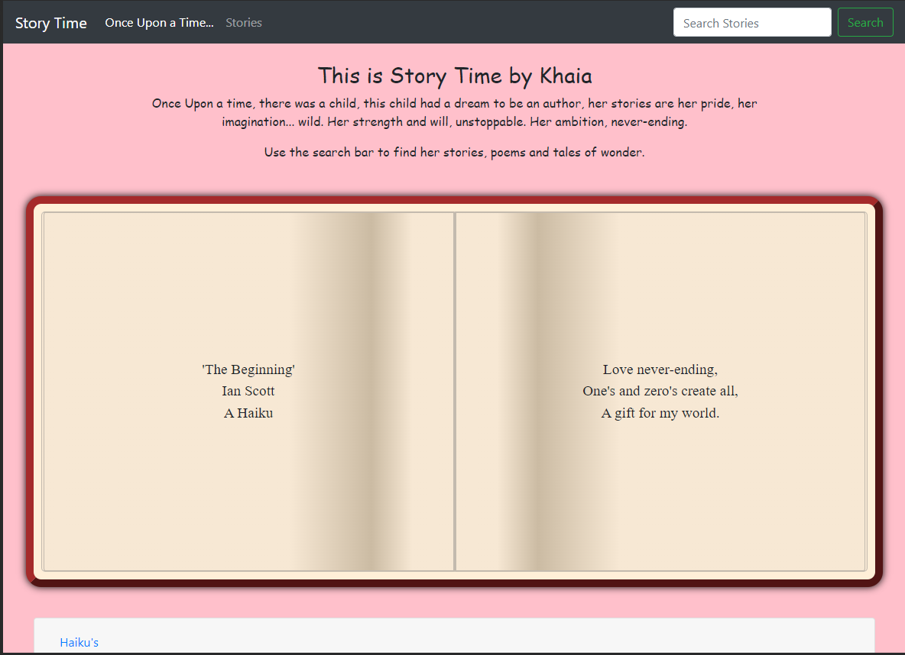

# story-book

## Description

This project was built to display short stories written by my daughter, who wanted the world to read her tales. The site has a search based navbar, with different catagories to filter the stories displayed, a main section with a brief description of current and upcoming stories, and a "book" section which will display a default story and any filtered choices. The site also has a timer to support and encourage longer periods of reading. 

## Front End

- HTML
- CSS
- JavaScript
- jQuery
- jQueryUI
- dayjs
- BootstrapCSS

## Roadmap

- JS functions to handle searches
- JS functions to display stories
- JS functions to record time spent learning
- JS function to handle page numbers

## Usage

N/A - Work in progress

## Support

For support contact via https://github.com/Jaycossey

## License

<a href="https://www.mozilla.org/en-US/MPL/2.0/" target="_blank" rel="no-referrer" crossorigin="anonymous">Mozilla Public License Version 2.0</a>